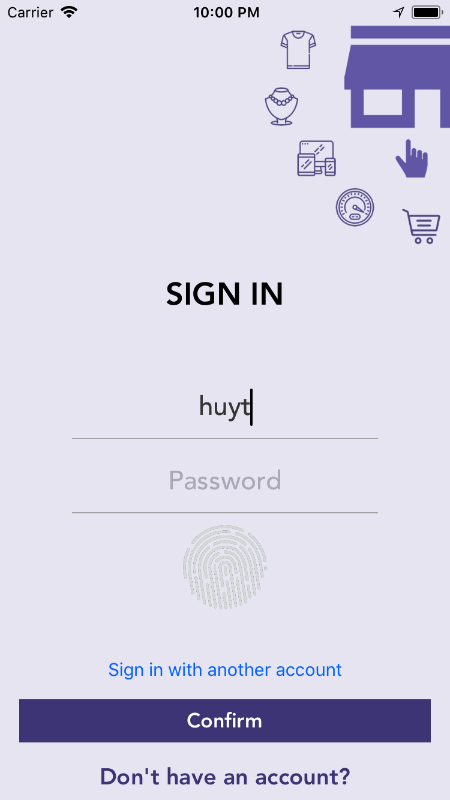
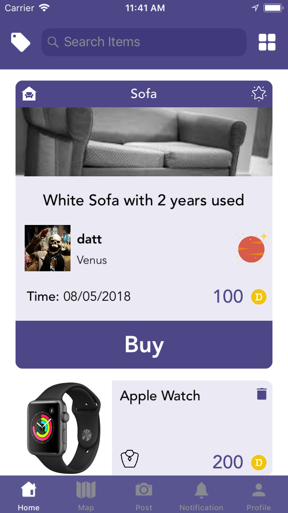
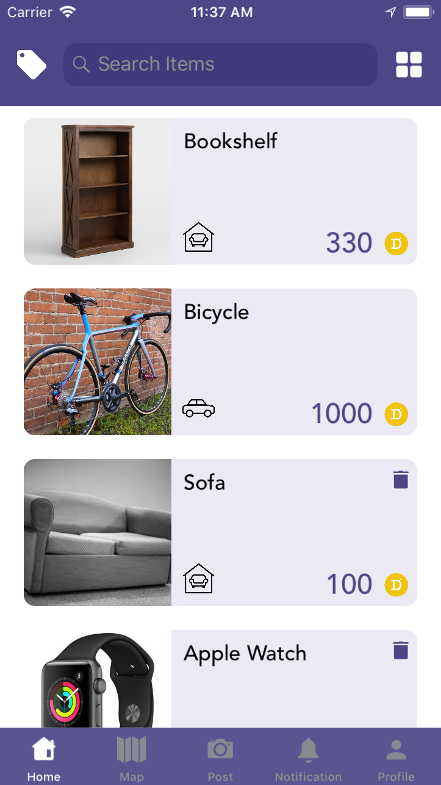
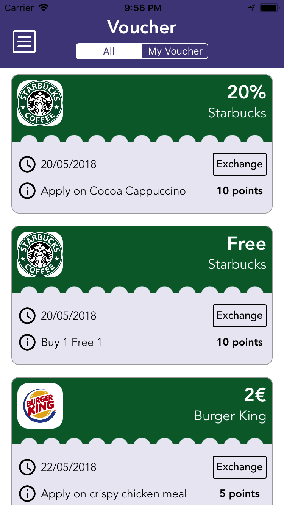
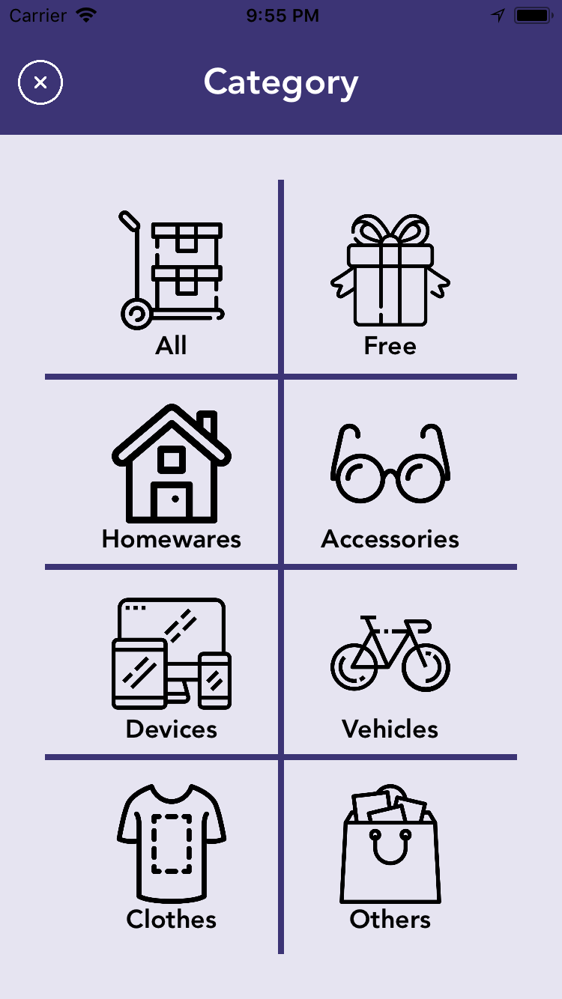
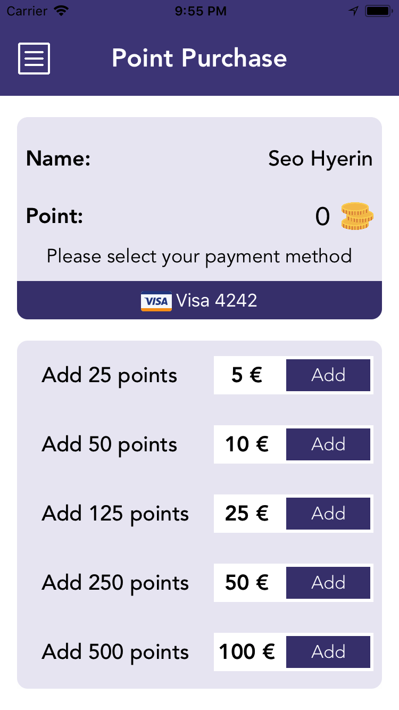
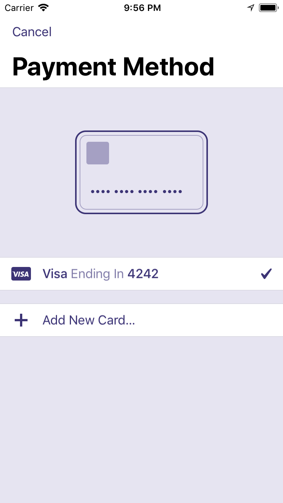

# Minida

## Item sharing platform, work in progress...

## Features
:white_check_mark: Swift  
:white_check_mark: MVP architecture  
:white_check_mark: TouchID/FaceID  
:white_check_mark: Map  
:white_check_mark: Simple Animation and Custom View  
:white_check_mark: Payment using [Stripe](https://stripe.com/fi)  
:white_check_mark:  Usage of libraries: 

## MLmodel
[Download](https://drive.google.com/open?id=1OVYOl5WrDjH139XIub1uYJfGx2rDH6L4)  
  
Instructions: Download the file and place it inside the Project_Ios folder

## TODO list:
:white_large_square: Upload item screen  
:white_large_square: Buy item screen  
:white_large_square: Localization  
:white_large_square: Notification  

| Login     | Register   | Home     |
| :-------------: | :-------------: | :-------------: |
|  |  |  |

| Menu    | Map    | Voucher    | 
| :-------------: | :-------------: | :-------------: |
|  |  |  |

| Category    | Payment    | Add Card     | 
| :-------------: | :-------------: | :-------------: |
|  |  |  |
